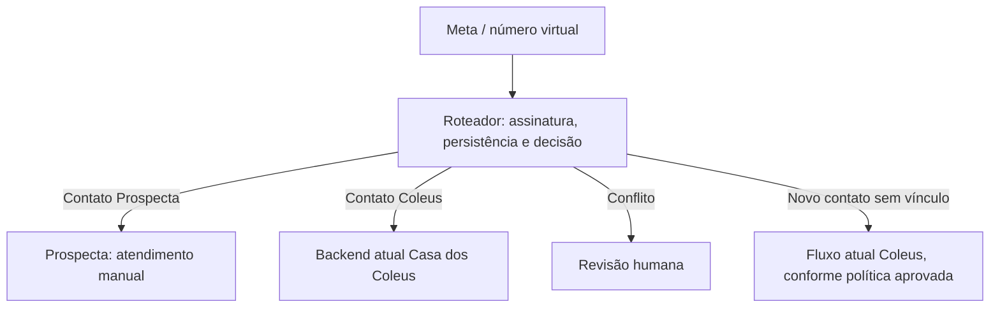

# Proposta — um número, dois projetos

**Estado: para revisão. Não implementada nem ativada.**

## Decisão proposta

Colocar um roteador independente entre a Meta e os dois backends. Ele seria o único receptor público dos eventos do número compartilhado, decidiria um destino por contato e manteria uma fila durável de entrega. A mudança de callback só ocorreria após validação e aprovação da configuração concreta de produção.

O código, o catálogo, o banco e o deploy de cada projeto continuam independentes. Reaproveitar o número significa compartilhar identidade comercial, limites e reputação do remetente na Meta; o roteador separa processamento, mas não separa esses atributos. Um contato que conversa com as duas marcas verá a mesma conversa no WhatsApp.

## Regra de propriedade

Chave: `(phone_number_id, telefone/wa_id normalizado)`. Cada vínculo tem projeto responsável, origem da decisão, data e versão. Não inferir o projeto por palavras como “estoque”, “preço” ou “planta”: respostas curtas e contexto acumulado tornariam isso frágil.

| Situação | Decisão proposta |
| --- | --- |
| Vínculo exclusivo com Prospecta | Entregar apenas ao CRM; jamais encaminhar para Coleus. |
| Vínculo exclusivo com Coleus | Entregar apenas ao backend atual. |
| Telefone vinculado aos dois | Quarentena e seleção humana antes de resposta automática. |
| Sem vínculo | Preservar o fluxo atual de Coleus, desde que aprovada essa regra; cadastrar vínculo Coleus antes da entrega. |
| Falha ao consultar os vínculos | Guardar na fila e aguardar recuperação, sem escolher destino por suposição. |
| ID de número não previsto | Isolar para diagnóstico; não entregar a nenhum projeto. |

O cadastro de um lead Prospecta deve reservar o vínculo no roteador **antes de habilitar o primeiro envio**. Os 15 leads do documento não devem ser reservados cegamente: primeiro conferir se algum telefone já pertence ao atendimento Coleus. A troca de proprietário não pode liberar callbacks antigos para o novo destino.

## Contrato de entrega e isolamento

1. Validar HMAC nos bytes originais. Persistir evento + destinatário escolhido + versão do vínculo antes de responder 200 à Meta. Falha de persistência retorna erro para permitir reentrega.
2. Dividir lotes por mensagem/status/eco individual. Um envelope pode conter contatos de ambos os projetos; não repassar o lote inteiro para ambos.
3. Congelar a decisão por evento. Deduplicar por identificador Meta e tipo; para status usar também status/timestamp. Reprocessamento usa o destino registrado, mesmo após troca de vínculo.
4. Entregar por filas independentes, com retentativa limitada e alerta. Indisponibilidade do CRM acumula sua fila e não bloqueia Coleus. Nunca usar Coleus como fallback para Prospecta.
5. Para Coleus, preservar o contrato de webhook atual. O payload filtrado altera os bytes: o roteador precisa assinar novamente o envelope com o segredo apropriado. Não reutilizar a assinatura Meta original em JSON transformado. O segredo ficaria em ambiente restrito do roteador, nunca no browser/CRM.
6. Status de saída devem seguir o projeto dono do `wamid` registrado no momento do envio. Antes desse registro existir, reter o status brevemente para conciliação. Status legados conhecidos do Coleus seguem para Coleus; desconhecidos ficam para classificação, sem espalhar IDs pelos dois bancos.
7. O webhook existente permaneceria exposto ao menos durante transição. Restringir sua origem no proxy/rede ao roteador após a mudança evita uma segunda entrada. Se isso não for possível sem afetar o serviço, registrar o limite e revisar antes da ativação.

## Ponto crítico encontrado no Coleus

O bot atual mantém filas, deduplicação e pausas em memória. Mesmo com um novo roteador, uma resposta de Coleus já agendada para um contato pode executar após ele ser transferido para o Prospecta. Logo, roteamento de eventos futuros sozinho não basta.

**Para um piloto sem alterar seu código:** usar somente contatos de teste que não tenham conversa/timer ativo em Coleus, manter propriedade fixa durante o piloto e verificar a configuração real das flags/allowlists. Se houver conflito ou necessidade de transferir contato ativo, adiar a transferência. Não reiniciar o bot ou cancelar atendimento de clientes como atalho.

Para troca de propriedade em produção, será necessário um mecanismo aprovado de pausa/cancelamento por contato que cubra timers existentes e persistência. Isso é uma mudança separada no Coleus, ainda não autorizada para implantação e não executada nesta entrega.

Além disso, seu ACK de webhook atual não demonstra processamento durável até a resposta final do bot. O roteador consegue garantir armazenamento e entrega ao backend; garantia fim a fim após reinício do Coleus exigirá evolução da fila do bot. Não prometer “zero perda” com o contrato atual.

## Implantação proposta, após aprovação

1. Inventariar de forma somente leitura app, WABA, `phone_number_id`, callback, assinaturas, flags e política de número de teste vigentes. Guardar configuração de rollback em cofre próprio; não no Git.
2. Subir o roteador em serviço/volume/segredos independentes e testar apenas eventos sintéticos. Definir acesso humano à fila de conflitos, observabilidade sem conteúdo de mensagens e retenção dos eventos.
3. Reservar um contato de teste autorizado exclusivamente ao Prospecta. Confirmar ausência de atendimento/timer pendente no Coleus e identidade comercial adequada ao teste.
4. Revisar callback exato, endpoints de destino, política para novos contatos, plano de transição e rollback. A aprovação deve ser sobre esses valores concretos, não sobre comandos genéricos.
5. Fazer a mudança controlada de callback, sem registrar/migrar novamente o número nem alterar catálogo ou templates do Coleus. Testar as duas rotas e os respectivos envios com contatos autorizados.
6. Acompanhar fila, duplicatas, status e respostas cruzadas. Habilitar gradualmente leads reservados e revisados. Não abrir prospecção geral no primeiro teste.

## Rollback

Parar novos envios do Prospecta e congelar alterações de propriedade. Preservar fila, vínculos e auditoria. Durante o piloto com contatos controlados, drenar/isolar eventos pendentes e decidir quais contatos precisam continuar em atendimento manual.

Restaurar simplesmente o callback antigo faria respostas futuras de leads Prospecta voltarem ao bot de Coleus. Portanto, **depois do primeiro contato real do Prospecta, restaurar o callback só é seguro com exclusões persistentes desses telefones no Coleus ou após um plano de encerramento aprovado**. Até existir esse mecanismo, a recuperação preferida é restaurar a versão saudável do próprio roteador, mantendo os vínculos Prospecta isolados e Coleus encaminhado normalmente.

Se a preservação dos clientes Coleus exigir continuidade sem essa dependência adicional, manter o CRM em simulação ou usar outro número é o caminho viável até concluir a integração.

## Critérios de aceite do roteador futuro

- Evento Prospecta resulta em zero chamadas ao Coleus, inclusive em timeout, reinício e reentrega.
- Evento Coleus preserva payload semântico, contrato e comportamento existente.
- Lote misto, múltiplos entries, mídia, pedidos nativos, ecos manuais e status fora de ordem mantêm o isolamento.
- Queda de um destino não paralisa o outro; ACK só após persistência durável.
- Transferência de contato com timer pendente é bloqueada até haver solução validada.
- Testes do Coleus continuam passando em ambiente separado; nenhum dado real entra em fixtures.
- Acesso à fila e mudanças de vínculo são autenticados e auditáveis.
- Operador consegue verificar entrega incerta sem repetir envios.
- Plano de rollback não redireciona inadvertidamente leads Prospecta ao bot Coleus.

## O que precisa ser aprovado

A arquitetura, a política de novos contatos, o tratamento de sobreposição e o piloto com propriedade fixa. Após implementação e inventário, revisar os valores concretos da mudança de callback. Nenhuma dessas ações externas foi realizada nesta etapa.
